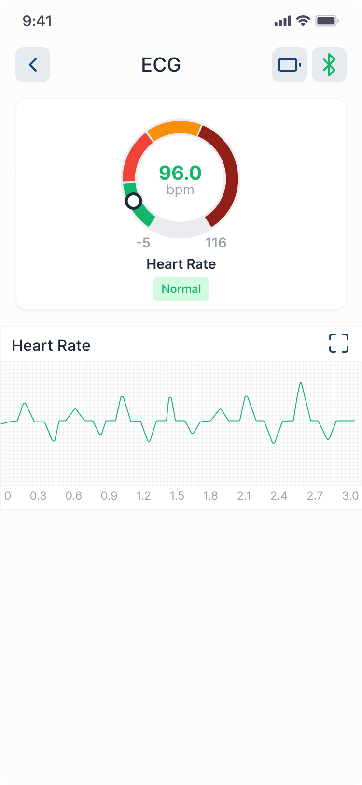

# List of endPoints

## Schedule

- /getTodaySchedule
- /getWeeklySchedule
- /adhoc || /submitManualReading || /medicineTaken

### getTodaySchedule / getWeekly

   
   

### Manual or Device Reading

   
   
   

## PHR

- /getPHRData
- /getECGData
- /getComplianceList
- /getComplianceDetails

### getPHRData

   

  
   

### getComplianceDetails

   
   

### getRecentCalls

## Call / Messages

- /getRecentCalls
- /makeCall
- /getSubjects
- /getMessages
- /uploadFile
- /sendMessage

### makeCall

  

   
   

### Miscellaneous

- /updateProfile
- /getSetting

   
   
   

### Devices Result Screens

- BP2

-Blood Glucose Onetouch

- Weighing Scale

- PC60FW Oximeter

- Checkme Pro

### Onboarding Screens

