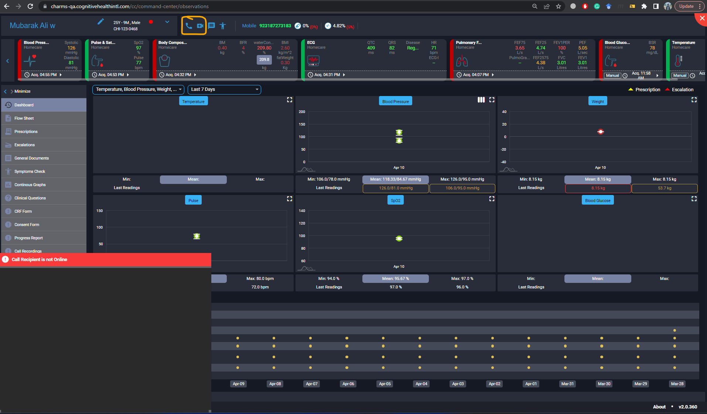

https://balsamiq.cloud/s2vk1w4/pj90yby/r7D09?f=N4IgUiBcCMA0IDkoAZ4GEXwDJTiAQrvALJEgBaZA0lANqgBOUI00%2BGAvrI88gGIBWPiC49IBAExpO3EE3EARBchliQEhRIAcI2fJABOZAHYAorrUSBANgAsFuc2vQ%2Bw0Y%2FFa%2B1t3qffoB30FNh13fWsDU3NwpwUtGL9xVjYg5jQtW2s08WM%2BNHtY8T5oU0IikGM0CUCK5Hw%2BZByQAEEVbIrTKpbmjIkAZmboFoNfNVsQ8qSQNHwtJoqC6wlmvlsBHor%2B4xaBZoV%2B5D2K%2BZLm037%2B1Q9KlU3ptGhbKbVrAQEVzpNBisFWXr4Cmu%2BmQWjszVs1USahaEkizX680K0wExgkn2mxn6%2BAUzRaFxeN0BUmaWn6cPOQg60wkfAMPxpBVxFTsEkJ%2BnwtmMzOmpmQoKGXQxahxBgMzXw%2BFGq1MGlW%2FT47OYxmQEnu4yMyLUpj4xiVigUBi1N1MClMYRReuFN2gCmeEIMcwRaENQ25tRpfItMJaCtJXIW0x8F2aBhaBwhh0DML4%2BN6WhszWMtnDzQECmsDLUaLJIgAuhwgA%3D%3D%3D

PHR .....,Patient resutlable ranges, Active Orderables, Caregivers, Allergies, Escalation/Messages, Meal Plan

## 1.1 Add Employee

## 1.3 Patient

## 1.5 Master Setting.jpg

- Patient Sponsors
- Manufacturer
-

## 1.6 Add Orderable.jpg

patient sponsor
Manufacturer
Medications
Orderables
Orderable Instructions
Resultables
Allergies
Diagnosis
Clinical Events
Clinical Event Questions

## 1.7 Device Configuration.jpg

## 1.8 Add Device Model.jpg

## 2.1 PHR.jpg

## 2.3 Orderable schedule and assignment.jpg

## 2.4 Edit Orderable.jpg

## 2.5 Device Assignment.jpg

## 2.6 Normal Ranges.jpg

## 2.7 Assign Caregiver.jpg

## Add Device.jpg

## Billable Events Report.jpg

## Calls.png

## Escalate.jpg

## Escalated.jpg

## Live session.jpg

## Observation Report.jpg

## Ongoing Session.jpg

## aaa.jpg

