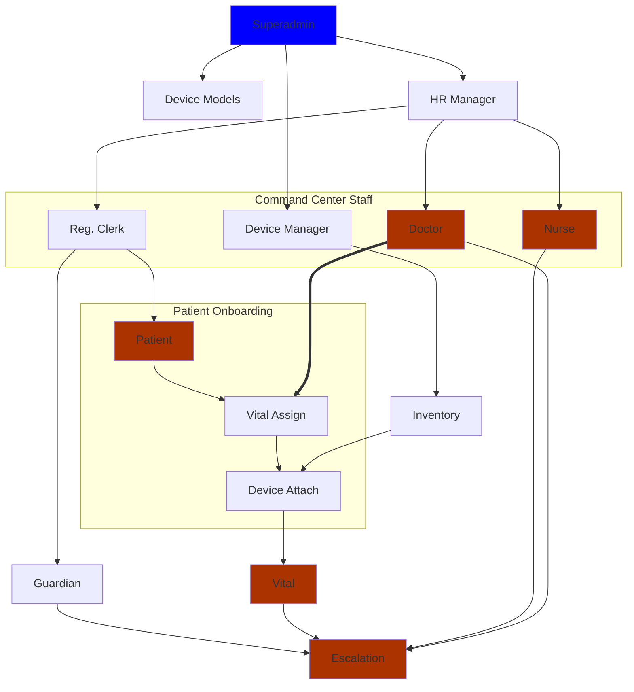
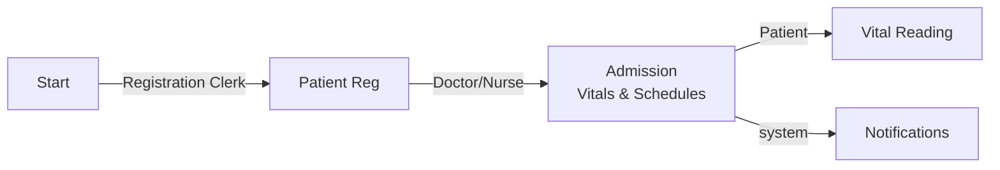
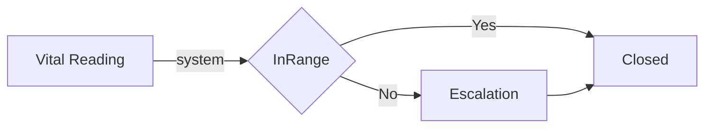

# Executive Summary:

A system to monitor patients vitals and medication admistration remotely by a set of health professionals for proactive healthcare.

- Proactive healthcare
- Comfort of home

The health data coming from the patient can be discrete or continuous (Temperature or live ECG)

## Definitions:

- Command Center: A central location where data will be monitored
- Caregiver: Doctor or Nurse
- Patient: The patient to be monitored
- Guardian: Patients family member participating in care
- Admission: A homecare admission/episode.
- Order: A schedule of a vital (orderable).
- Resultable: A reading (e.g., Temperature, Systolic, ...)
- Escalation: A workflow of managing abnormal reading
- PHR: A dashboard of patient health data.

## Roles

Functionalities in UI depend upon the Roles(s) of the user.

- Patient, Guardian, CCNurse, CCDoctor, ...
- A Role is a collection of permissions (for time being permissions table can be skipped)
- A User can have multiple roles (DeviceManager, CCDoctor, CCNurse, ClinicDoctor, Accountant)
  Each role can be thought as a mini-app(module) or a 'bigger' set of menus
- A person can have DOCTOR, CC_NURSE, PRE_CONSULTATION_NURSE, ... roles, so that one person can manage the whole clinic/command center
- When user logs in, he will either see:

  - A set of tiles if roles are unrelated (e.g. patient & doctor are unrelated)
  - A menusystem/miniapp if all his roles are related (CCNurse & CCDoctor are related)
  - Some functionalitites might be common for all (ChangeProfile, CheckSymptoms, ..)
    and can appear as common tiles, menus.

- Send his roles back in login call so that UI can be configured accordingly.

- Guardian
  - Keep guardian table so that we can have relevant fields if needed. (one primary guardian)
  - Keep guardian as 1:1 for time being, later will will have n:n
  - AdmissionCaregiver will have a column isPrimary
    - can add primaryGuardian in admission, so that we can keep track which admission has which guardian.
      Similarly, it can have a column isGuardian
  - While adding multiple caregivers, we will show all CCNURSES, CCDOCTORS, GUARDIANS in dropdown
    (AdmissionCaregivers is a table of Guardian, Nurse, Doctor, ...)
    Patient can't be in caregiver. All other users can be in caregivers.

# PHASES OF COMMISSIONING

The following steps are involved in commissioning the system.

- Basic Seeding
- Warnup
- Commissioning

## BASIC SEEDING

| Type        | Tables                 | Examples           |
| ----------- | ---------------------- | ------------------ |
| Vital Data  | Orderables             | Blood Pressure,    |
|             | Resultables            | Systolic, Distolic |
|             | OrderableToResultables |                    |
| Device Data | Manufacturers,         | Philips, Siemens   |
|             | Device Types           | Oximeter, ..       |
|             | Device Models          | BP2, PC102, ..     |

## SYSTEM WARM UP

| ROLE           | Manages                          |
| -------------- | -------------------------------- |
| Super Admin    | Basic Seed Data                  |
|                | HR Manager                       |
| HR Manager     | Doctor                           |
|                | Nurse                            |
|                | Device Manager                   |
| Device Manager | Add Inventory                    |
| Doctor         | Admits Patient                   |
|                | Responds to Escalation           |
| Nurse          | Manages incoming observations    |
|                | Initiates and manages Escalation |

## HIGH LEVEL DEPENDENCY GRAPH

The following high level dependency graph shows the order in which different workflows can be executed.

# WORKFLOWS

## STANDARD WORKFLOW

### Patient submits reading

### Management of Readings

The escalation consists of inter

## OTHER POSSIBLE WORKFLOWS

Patient can be remotely monitoried. He sends vital readings (via devices or manual).

1. Create doctors, nurses,
1. add device inventory, ... can added later also
1. Nurse Patient Regitstration via web
   - assign guardian (no guardian app yet)
1. Patient installs app
1. Logins

- no admission
  - admission done
    - add to admission doctor so that doctor can get patient list
    - notification for admission
    - message subject created for each order - Blood Pressure General (system owner, null owner
      - patient and doctor in SubjectGp)
    - guarantee that sched instance properly computed
    - send schdInst notifications - via timer ...
    - notifications for missed schedules timer ...

4. Admission/Order/device information pulled by app

- today's schedule shown
- user takes manual or device reading
  - manual or device reading within/outside schedue (4 cases)
  - reading broadcast to command center/doctor app

1. Escallation

- if CC escalates, subject and users created, message: nurse types message (subject: Blood Pressure esc)
- doctor responds, option to send message to user

2. Compliance/missed reports

- per patient vital range
- internationalization
- patient app gives the +-10 min alarms.

===========================================================
VITALS SUBMISSION USE CASES

1. Patient submits ad-hoc reading of Orderable without admission
2. Patient submits ad-hoc reading of Orderable with admission
   but without order item
3. Patient submits ad-hoc reading of Orderable with admission
   but without order item, BUT an ordered item was found and
   automatically attached
4. A separate endpoint receives a list of resultables, makes
   an orderable out of and manages accordingly

Vital/Orderable compliance is computed and updated appropriately

===========================================================

# tasks for others

- Write down workflows (with permissions)

  - Add user workflow

    > Register user (at least admin)
    > Register Employee
    > Add inventory (PC102, ...)
    > Admit patient

  - Assign vitals
    > Notification comes
    > think about test cases, and spin it off to somebody.
    > Patient submits adhoc reading
    > Patient submits scheduled reading
    > Device submits data
    > Value escalated by nurse
    > Doctor responds (may be possible escallation to other doctor???)
    > PHR view
    > File uploads ?? Profile picture, some document which patient wants to show to doctor
