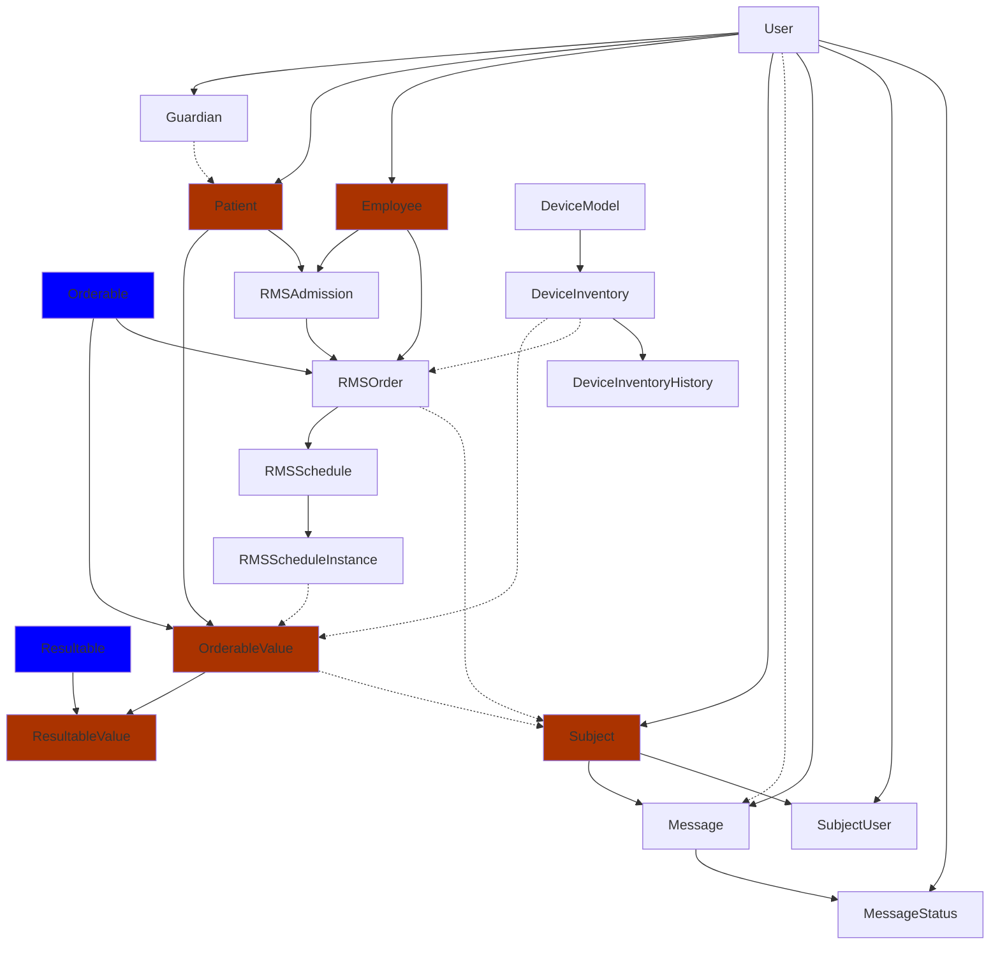
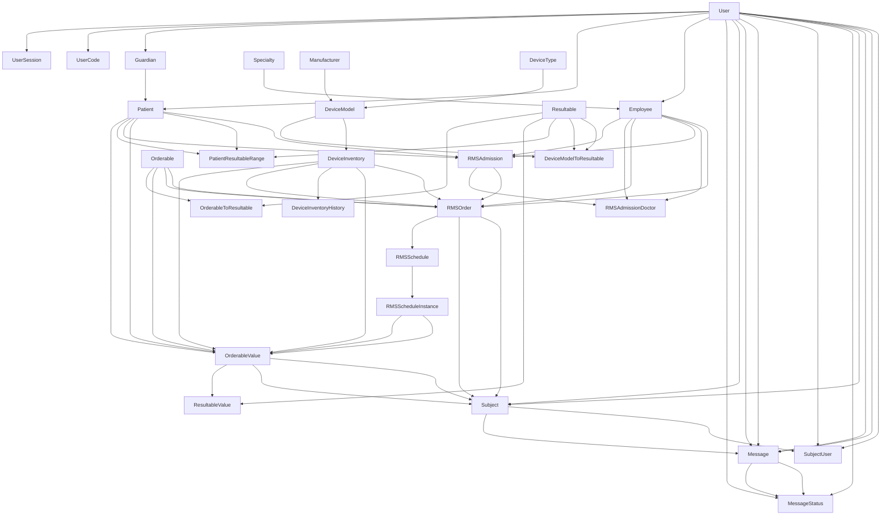

## Less Important Tables

- UserSession
- UserCode
- RMSAdmissionCaregiver
- Specialty
- OrderableToResultable
- DeviceModelToResultable
- DeviceInventoryToResultable
- Manufacturer
- DeviceType
- RMSAdmissionDoctor
- PatientResultableRange

## Complete

## Complete Diagram with All Tables

