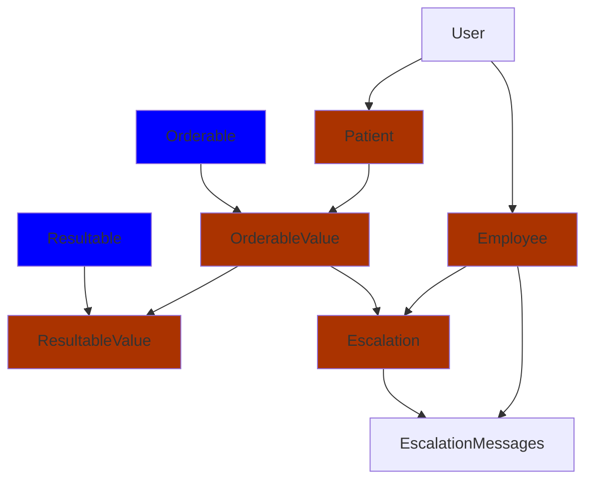
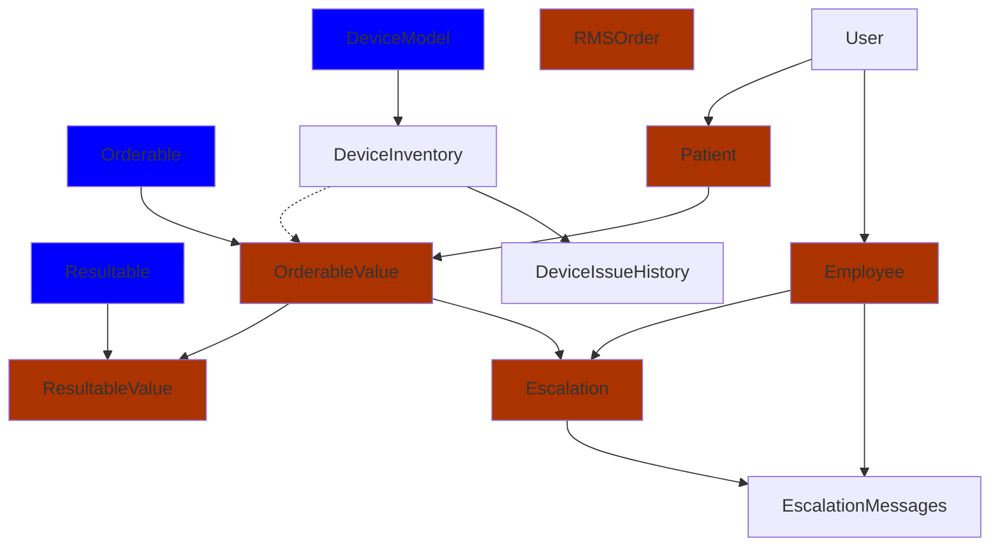
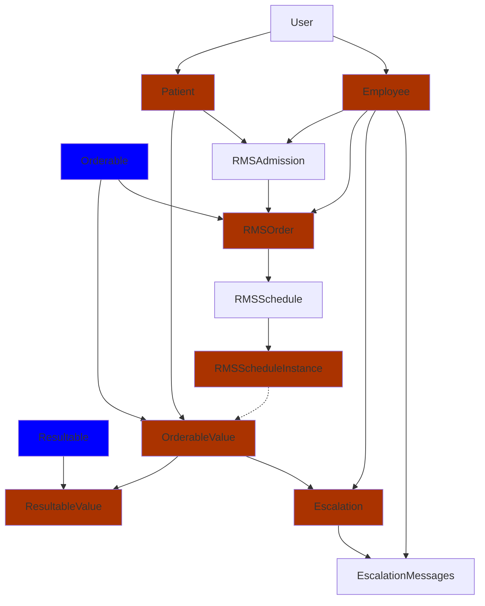
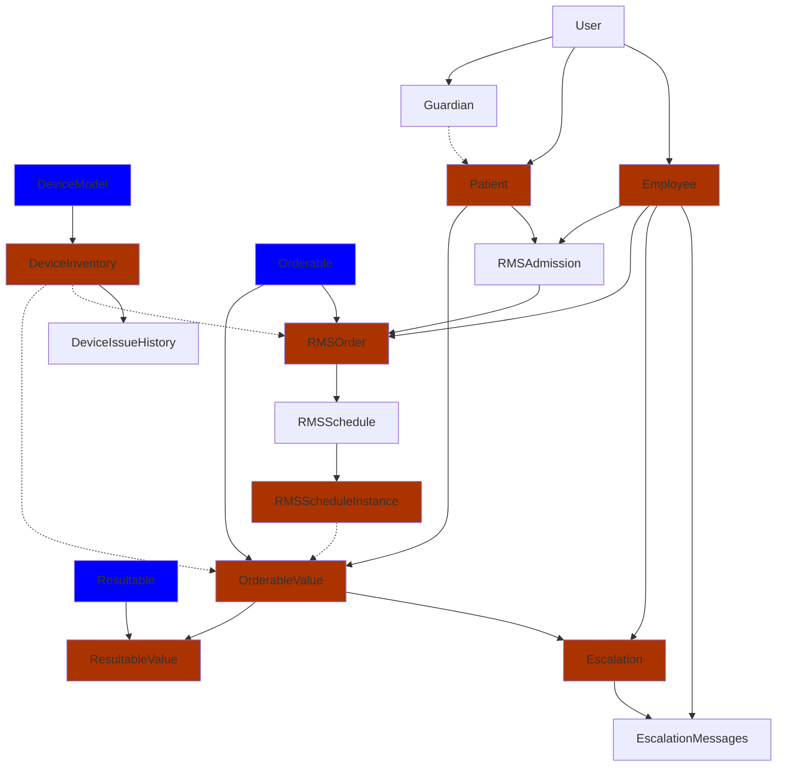
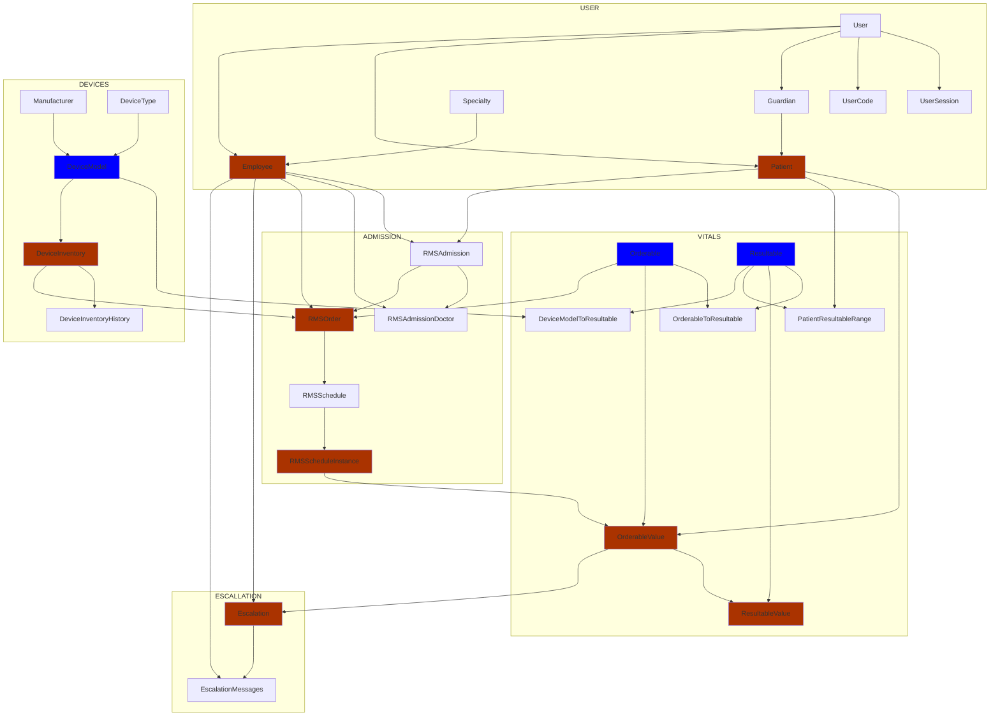

## Flutter/Angular generation.

- Write down workflows (with permissions)
- file upload mechanism
- RMS
  - Notification mechanism
  - Scheduling, timers, etc.
  - ....

## Things to do

1. Escallations (messaging)
1. Device Assignment
1. Continouous devices
1. Calls
1. Messages
1. Translations (LTR, RTL)
1. CGMS
1. realtime (TOCO, PC102, etc)

KAFKA STUFF

## Less Important Tables

- UserSession
- UserCode
- RMSAdmissionDoctor
- Specialty
- OrderableToResultable
- DeviceModelToResultable
- DeviceInventoryToResultable
- Manufacturer
- DeviceType
- RMSAdmissionDoctor
- PatientResultableRange

## Without Devices and Admission

## Without Admission (With Devices)

## Without Devices

## Complete

## Complete Diagram with All Tables

